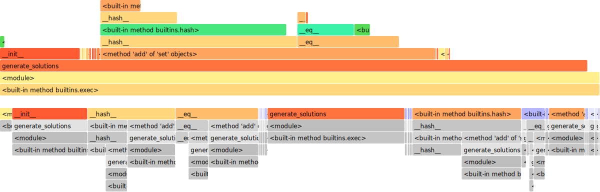
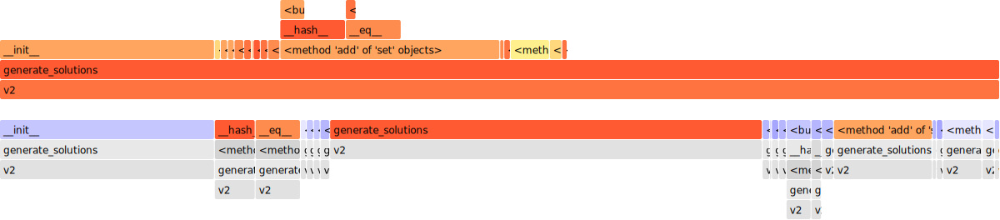

# Improving performance

## Base performances

With the reference input, the base algorithms runs in 4.40 seconds on average, with a best run around 3.84 seconds.

| ncalls           | tottime | percall | cumtime | percall | filename:lineno(function)                         |
| ---------------- | ------- | ------- | ------- | ------- | ------------------------------------------------- |
| 1                | 2.785   | 2.785   | 11.913  | 11.913  | summle.py:71(generate_solutions)                  |
| 12357207/1247601 | 2.215   | 0.000   | 3.779   | 0.000   | {built-in method builtins.hash}                   |
| 12357207/1247601 | 1.780   | 0.000   | 3.995   | 0.000   | summle.py:34(**hash**)                            |
| 3290588/841924   | 1.684   | 0.000   | 2.068   | 0.000   | summle.py:37(**eq**)                              |
| 1571688          | 1.530   | 0.000   | 1.627   | 0.000   | summle.py:23(**init**)                            |
| 1247601          | 0.730   | 0.000   | 6.793   | 0.000   | {method 'add' of 'set' objects}                   |
| 8152858          | 0.481   | 0.000   | 0.481   | 0.000   | {built-in method builtins.isinstance}             |
| 717575           | 0.126   | 0.000   | 0.126   | 0.000   | {method 'copy' of 'list' objects}                 |
| 786988           | 0.079   | 0.000   | 0.079   | 0.000   | {method 'pop' of 'list' objects}                  |
| 648165           | 0.076   | 0.000   | 0.076   | 0.000   | {built-in method builtins.len}                    |
| 393494           | 0.063   | 0.000   | 0.063   | 0.000   | summle.py:66(<lambda>)                            |
| 391163           | 0.046   | 0.000   | 0.046   | 0.000   | {built-in method \_operator.sub}                  |
| 393494           | 0.046   | 0.000   | 0.046   | 0.000   | {built-in method \_operator.add}                  |
| 379162           | 0.045   | 0.000   | 0.045   | 0.000   | {built-in method \_operator.mul}                  |
| 393494           | 0.045   | 0.000   | 0.045   | 0.000   | summle.py:63(<lambda>)                            |
| 324081           | 0.040   | 0.000   | 0.040   | 0.000   | {method 'append' of 'list' objects}               |
| 393494           | 0.040   | 0.000   | 0.040   | 0.000   | summle.py:64(<lambda>)                            |
| 393494           | 0.034   | 0.000   | 0.034   | 0.000   | summle.py:62(<lambda>)                            |
| 324082           | 0.033   | 0.000   | 0.033   | 0.000   | {method 'popleft' of 'collections.deque' objects} |
| 324081           | 0.025   | 0.000   | 0.025   | 0.000   | {method 'append' of 'collections.deque' objects}  |
| 83782            | 0.011   | 0.000   | 0.011   | 0.000   | {built-in method \_operator.floordiv}             |

## V2

- Replace the custom hash/eq methods with the built-in for str instead, by maintaining a str of the formula at every step

Average: 2.31s, best: 1.61s

| ncalls  | tottime | percall | cumtime | percall | filename:lineno(function)                         |
| ------- | ------- | ------- | ------- | ------- | ------------------------------------------------- |
| 1       | 2.304   | 2.304   | 5.410   | 5.410   | summle_v2.py:68(generate_solutions)               |
| 1247607 | 1.203   | 0.000   | 1.203   | 0.000   | summle_v2.py:24(**init**)                         |
| 1247601 | 0.535   | 0.000   | 1.192   | 0.000   | {method 'add' of 'set' objects}                   |
| 841924  | 0.234   | 0.000   | 0.297   | 0.000   | summle_v2.py:38(**eq**)                           |
| 1247601 | 0.219   | 0.000   | 0.360   | 0.000   | summle_v2.py:35(**hash**)                         |
| 717575  | 0.212   | 0.000   | 0.212   | 0.000   | {method 'copy' of 'list' objects}                 |
| 1247601 | 0.141   | 0.000   | 0.141   | 0.000   | {built-in method builtins.hash}                   |
| 786988  | 0.066   | 0.000   | 0.066   | 0.000   | {method 'pop' of 'list' objects}                  |
| 648165  | 0.066   | 0.000   | 0.066   | 0.000   | {built-in method builtins.len}                    |
| 841924  | 0.063   | 0.000   | 0.063   | 0.000   | {built-in method builtins.isinstance}             |
| 393494  | 0.050   | 0.000   | 0.050   | 0.000   | summle_v2.py:63(<lambda>)                         |
| 391163  | 0.042   | 0.000   | 0.042   | 0.000   | {built-in method \_operator.sub}                  |
| 393494  | 0.041   | 0.000   | 0.041   | 0.000   | {built-in method \_operator.add}                  |
| 379162  | 0.040   | 0.000   | 0.040   | 0.000   | {built-in method \_operator.mul}                  |
| 393494  | 0.037   | 0.000   | 0.037   | 0.000   | summle_v2.py:60(<lambda>)                         |
| 324081  | 0.035   | 0.000   | 0.035   | 0.000   | {method 'append' of 'list' objects}               |
| 393494  | 0.034   | 0.000   | 0.034   | 0.000   | summle_v2.py:61(<lambda>)                         |
| 393494  | 0.030   | 0.000   | 0.030   | 0.000   | summle_v2.py:59(<lambda>)                         |
| 324082  | 0.028   | 0.000   | 0.028   | 0.000   | {method 'popleft' of 'collections.deque' objects} |
| 324081  | 0.023   | 0.000   | 0.023   | 0.000   | {method 'append' of 'collections.deque' objects}  |
| 83782   | 0.009   | 0.000   | 0.009   | 0.000   | {built-in method \_operator.floordiv}             |

Observations:

- much faster (x 1.9)
- no more recursive calls, hash and eq are now essentially immediate
- same number of calls though (1247607), i.e. same number of solutions generated and tested

## v3

- try to go for a full tuple implementation of Formula; hope it doesn't impact hash/eq time too badly
- simplify Solution init
- keep track of all seen solutions in one Set. Replace set by list for the result dict. -> why ?
